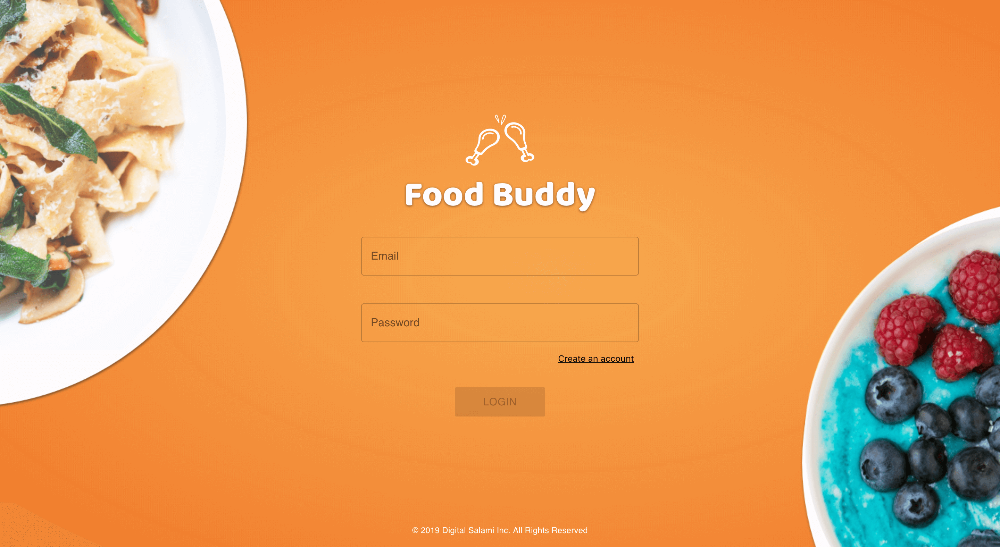
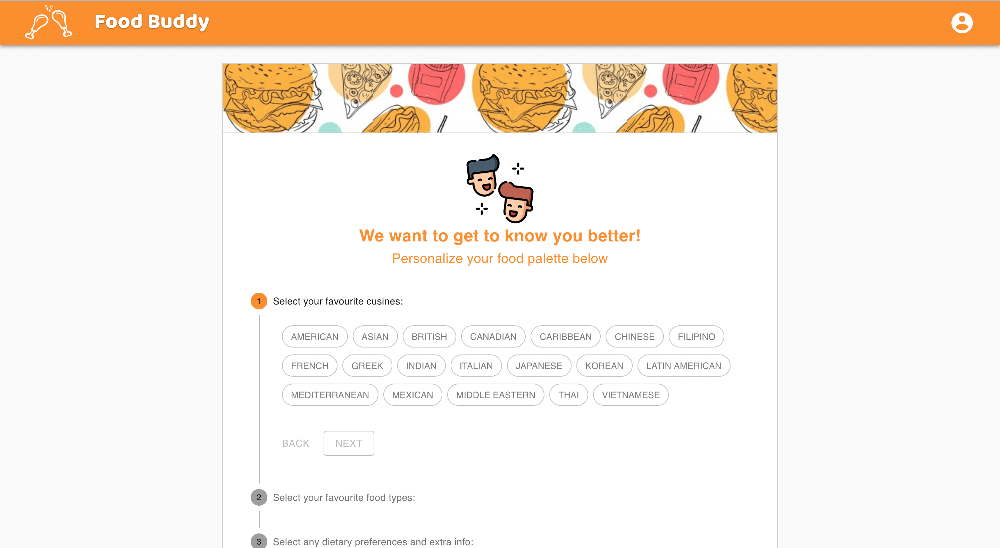
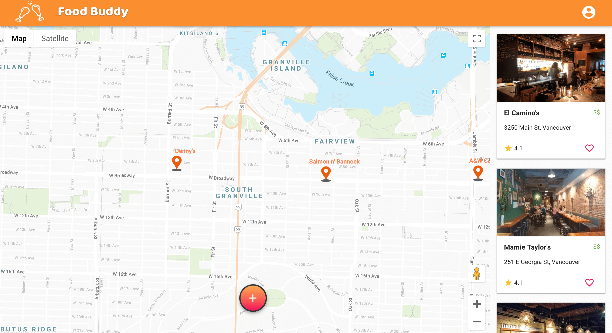
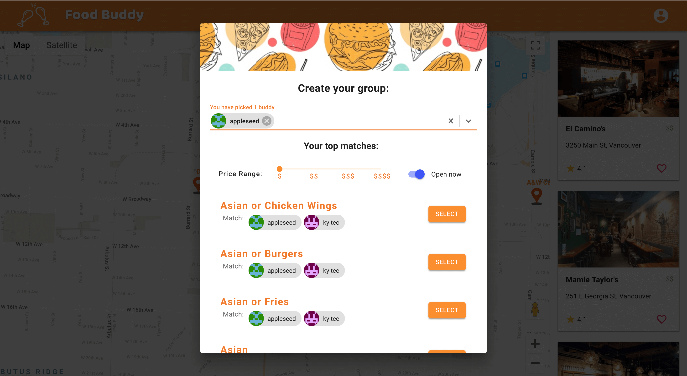

# food-buddy

Welcome to food buddy an app where you can decide where to eat with a group of friends based on your preferences. With the help of the Google Maps API we can filter throught restaurants near you and give suggestions based on the most common preference of the group.

# Screenshots

# Technologies Used

- Meteor
- Mongo DB
- React
- Material UI
- Google Maps API
- Simple Schema

# Authors

Sophie Virtue, Alex Fetisova, Victor Guo, Jen Yiu, Kyle Tecson
